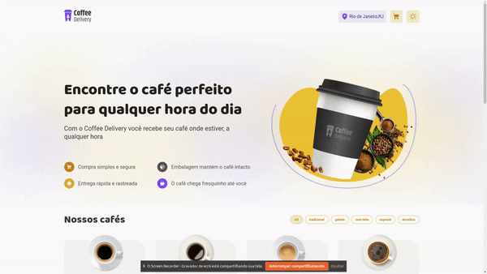

<h1 align="center"> Coffee Delivery </h1>

    Challenge do modulo 1 da Especialização de ReactJs atualização 2022

<h1 align="center">
    
</h1>

  <a href="#-tecnologias">Tecnologias</a>&nbsp;&nbsp;&nbsp;|&nbsp;&nbsp;&nbsp;
  <a href="#-projeto">Projeto</a>&nbsp;&nbsp;&nbsp;|&nbsp;&nbsp;&nbsp;
  <a href="#-layout">Layout</a>&nbsp;&nbsp;&nbsp;|&nbsp;&nbsp;&nbsp;
  <a href="#memo-licença">Licença</a>

  

 

## 🚀 Tecnologias

Esse projeto foi desenvolvido com as seguintes tecnologias:

- [React](https://reactjs.org)
- [TypeScript](https://www.typescriptlang.org/)
- [Styled-Components](https://styled-components.com/)
- [React Router Dom](https://vitejs.dev/)
- [Zod](https://zod.dev/)
- [Json web server](https://www.npmjs.com/package/json-server)

## 💻 Projeto
Projeto para Pratica dos conceitos do modulo 2 da Especialização em ReactJS

Desenvolver uma aplicação para gerenciar um carrinho de compras de uma cafeteria fictícia, que contém as seguintes funcionalidades:

- Listagem de produtos (cafés) disponíveis para compra
- Adicionar uma quantidade específicas de itens no carrinho
- Aumentar ou remover a quantidade de itens no carrinho
- Formulário para o usuário preencher o seu endereço
- Exibir o total de itens no carrinho no Header
- Exibir o valor total da soma de itens no carrinho multiplicados pelo valor

Apesar de serem poucas funcionalidades, você vai precisar relembrar conceitos como:

- Estados
- ContextAPI
- LocalStorage
- Imutabilidade do estado
- Listas e chaves no ReactJS
- Propriedades
- Componentização

Para rodar clone o repositório  `git clone git@github.com:DouglasO-R/coffee-delivery.git`, acesse a pasta do web `cd coffee-delivery`, instale as dependências `yarn`, e rode o app com `yarn dev` 

## 🔖 Layout

Nos links abaixo você encontra o layout do projeto web e também do mobile. Lembrando que você precisa ter uma conta no [Figma](http://figma.com/) para acessá-lo.

- [Layout Web/Mobile](https://www.figma.com/file/4Ss24hyzWag05A88X4znf7/Coffee-Delivery-(Copy))

## :memo: Licença

Esse projeto está sob a licença MIT.

